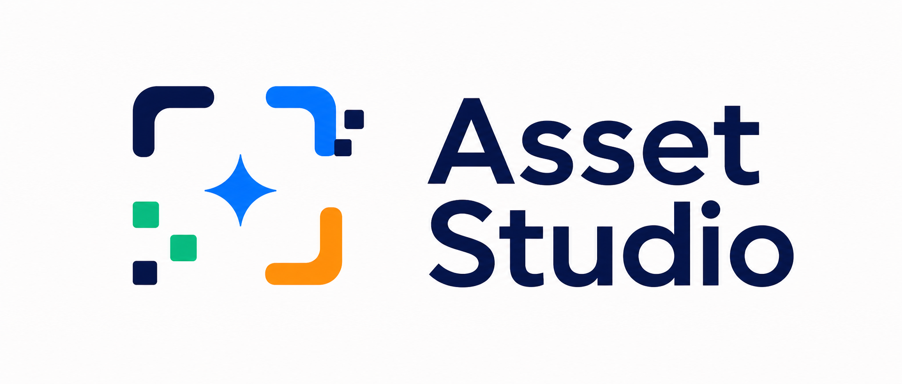

<p align="center">
  
</p>

# Asset Studio

Asset Studio is a local-first asset management tool for multi-project workspaces.

It runs as a pure Go CLI binary and opens a localhost UI. Release builds download
the UI bundle from GitHub Releases and cache it locally, following the same
distribution model as Skillshare.

## Development

```bash
go build -o bin/asset-studio ./cmd/asset-studio
./bin/asset-studio ui /path/to/project --no-open
```

For UI development:

```bash
cd ui
pnpm install
pnpm run dev
```

The Go server runs on `127.0.0.1:19520` by default. Use `--port` to bind a
different port. Vite proxies `/api` to it.

## 專案類型

新增專案時，Asset Studio 會請你選一個「專案類型」。這會影響它怎麼判斷
「未使用」、「Lint」和「是否可以安全刪除」。

Asset Studio 會先根據資料夾內容給一個建議，你也可以自己改。選好的類型會
顯示在專案卡片和設定頁的專案列表上。如果之後改了專案類型，請重新掃描，
因為原本的未使用與 Lint 結果可能已經不適合用。

### 我該選哪個？

| 類型 | 適合選這個的情況 | Asset Studio 會怎麼做 |
|------|------------------|------------------------|
| 程式碼專案 | 這是一個 app 或網站，圖片、icon、SVG 主要在同一個 repo 的程式碼裡使用。 | 會檢查哪些素材被程式碼引用，也會找出可以安全預覽刪除的未使用素材。 |
| 素材包 | 這是一包素材，例如 icon pack、設計輸出、圖片資料夾、sprite、vendor assets。 | 不會把「沒有被程式碼引用」當成問題，因為這些素材本來就可能被別的地方使用。 |
| 可重用 library | 這是一個會被其他專案引用的 package、component library 或 shared assets。 | 會顯示可能沒用到的檔案，但不會直接判定可以安全刪。 |
| 混合 / 不確定 | 這個資料夾內容很混雜，或你不確定素材是在哪裡被使用。 | 採保守判斷：可以協助你檢查，但不會輕易開放安全刪除。 |

### 哪些畫面會有差異？

| 畫面 | 會有什麼差異 |
|------|--------------|
| 新增專案 | 選完資料夾後會出現「專案類型」。Asset Studio 會自動建議一個類型，但你可以手動改。 |
| 專案卡片 | 卡片上會顯示類型 badge，例如「素材包」或「程式碼專案」。 |
| 設定頁的專案列表 | 可以看到並編輯專案類型。改完後請重新掃描。 |
| 瀏覽素材 | 「未使用」只代表可以安全進入 delete-unused preview 的項目；不安全的項目會顯示為「可能未使用」或不顯示未使用狀態。 |
| 素材 drawer | Usage 區塊會說明是「未使用」、「可能未使用」或「不適用」，delete-unused 按鈕也會跟著啟用或停用。 |
| 未使用 / 清理相關流程 | 素材包不會被整包列成未使用。Library、Mixed 只會提供人工確認用的「可能未使用」。 |
| Lint | 程式碼專案才是正式適用；素材包會跳過引用相關 Lint；Library、Mixed 僅供參考。 |
| 掃描進度 | 如果某些分析因專案類型被跳過，進度會顯示原因，例如素材包會跳過 references。 |

重複素材、相似素材、圖片 metadata、最佳化建議、預檢上傳這類不依賴程式碼引用
的功能，通常不會因專案類型而改變。

### 哪些操作會被限制？

| 類型 | 未使用狀態 | Delete-unused | Lint |
|------|------------|---------------|------|
| 程式碼專案 | 可顯示真正的「未使用」。 | 可用，但仍會先產生 preview，不會直接刪。 | 適用。 |
| 素材包 | 不適用；不會把整包素材當成未使用。 | 停用。 | 不適用，會跳過引用相關 Lint。 |
| 可重用 library | 只會顯示「可能未使用」。 | 停用。 | 僅供參考。 |
| 混合 / 不確定 | 只會顯示「可能未使用」。 | 通常停用。 | 僅供參考。 |

重點是：不要把「沒有找到引用」直接等同於「可以刪除」。只有畫面標示為
「未使用」且 delete-unused action 可用時，才代表 Asset Studio 認為可以進入
安全刪除預覽流程。

## 排除規則

設定頁的「排除規則」可以選擇不同範圍：

- `Global`：套用到所有專案。
- `程式碼專案`、`素材包`、`可重用 library`、`混合 / 不確定`：只追加到該類型的專案。

實際掃描時，Asset Studio 會先套用 `Global`，再套用該專案類型自己的規則。
例如 `Global` 有 `dist/**`，`程式碼專案` 有 `**/*.test.*`，那程式碼專案會同時
排除 `dist/**` 和測試檔；素材包則只會吃到 `dist/**`，除非素材包範圍也另外填規則。

規則是以「匯入的專案根目錄」為基準。單純檔名會匹配任何資料夾底下的同名檔案，
例如 `asset-studio-logo.png` 會排除 `ui/public/brand/asset-studio-logo.png`。
如果你匯入的專案路徑本身就是 `.../demo`，規則 `/demo/` 不會匹配該專案內所有檔案；
要排除整個 `demo` 資料夾，應該在上一層作為 project 匯入時使用 `demo/**`，或直接不要
把 `demo` 匯入成獨立 project。

通常建議：

- 所有專案都不想掃的資料夾放 `Global`，例如 `node_modules`、`.git`、`dist/**`。
- 只跟程式碼專案有關的測試檔、story 檔，放在 `程式碼專案`。
- 素材包預設不放排除規則，避免誤排掉素材本身。

## Devcontainer

```bash
make devc
ui /workspace
```

`make devc` starts the devcontainer and enters a shell. Inside the container,
`ui` starts the Go API with Air hot reload and the Vite UI. Browser/app-window
opening is best-effort inside the container; if no opener exists, use the printed
`http://127.0.0.1:5174` URL from the host browser.

## Commands

```bash
asset-studio ui [projectPaths...] [--port PORT] [--app]
asset-studio ui once [projectPaths...] [--port PORT]
asset-studio ui stop [--port PORT]
asset-studio version [--json]
asset-studio projects [--json]
asset-studio projects add [projectPaths...] [--scan-intent code|assetPack|library|mixed] [--json]
asset-studio projects detect-intent projectPath [--json]
asset-studio projects rename --id ID --name NAME [--json]
asset-studio projects remove --id ID [--json]
asset-studio settings get [--json]
asset-studio settings export [--output file.json] [--json]
asset-studio settings import file.json [--json]
asset-studio settings reset-database --confirm RESET [--json]
asset-studio scan [projectPaths...] [--json]
asset-studio scans list [--json]
asset-studio scans diff --base ID --target ID [--json]
asset-studio optimize estimate [assetIds...] [--json]
asset-studio optimize script [assetIds...] [--json]
asset-studio pre-check [filePaths...] [--json]
asset-studio actions rename preview --asset-id ID --target-path PATH [--json]
asset-studio actions merge-duplicates preview --asset-id ID --preferred-path PATH [--json]
asset-studio actions delete-unused preview --asset-id ID [--json]
asset-studio actions apply --preview preview.json [--json]
```

`--json` can be used before the command or after command arguments for AI/native automation.
`asset-studio ui` starts or reuses a background UI server and opens it in the default
browser. Use `--app` to open a desktop-style app window when Chrome, Edge, Brave, or
Chromium is available. Use `asset-studio ui once` for the foreground server behavior used
by Docker, Air, and long-running process managers. Use `asset-studio ui stop` to stop the
background server for a port. `--base-path` keeps the same reverse-proxy hosting behavior
as the Go-served UI.

## Safety

File-changing operations use preview/apply APIs. Apply revalidates the source
files before writing and rejects stale previews. CLI apply accepts preview JSON
from a file or stdin via `--preview -`.
