<p align="center">
  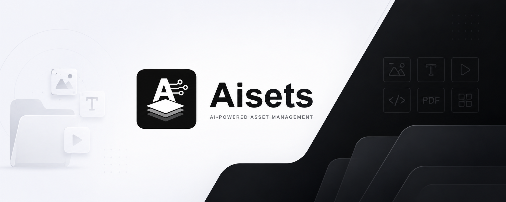
</p>

<p align="center">
  <a href="LICENSE"></a>
  <a href="https://github.com/runkids/aisets/releases"></a>
  
  <a href="https://deepwiki.com/runkids/aisets"></a>
</p>

<p align="center">
  <a href="https://github.com/runkids/aisets/stargazers"></a>
</p>

<p align="center">
  <strong>AI-powered asset intelligence for codebases.</strong><br>
  Audit image assets across projects: find duplicates, unused files, oversized images, OCR text, AI tags, and safe next actions — locally and visually.
</p>

<p align="center">
  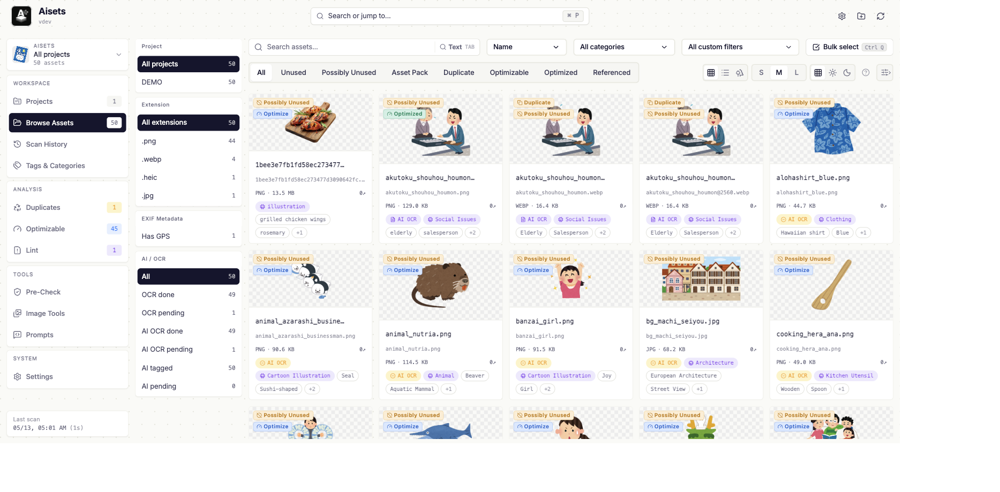
</p>

<p align="center">
  <a href="#install">Install</a> •
  <a href="#quick-start">Run UI</a> •
  <a href="#ai-canvas-demo">AI Canvas Demo</a> •
  <a href="#why-aisets">Why Aisets</a> •
  <a href="#ai-that-actually-helps">AI</a> •
  <a href="#what-were-building-next">Roadmap</a>
</p>

> [!IMPORTANT]
> Aisets is in active development. Expect fast iteration and review the release notes before updating.

## AI Canvas Demo

AI Canvas lets agents work visually with image assets: stage references, move the camera, zoom into details, arrange cards, capture the result, and explain the composition.

<p align="center">
  <a href=".github/assets/readme-ai-canvas-toy-shop-demo.mp4">
    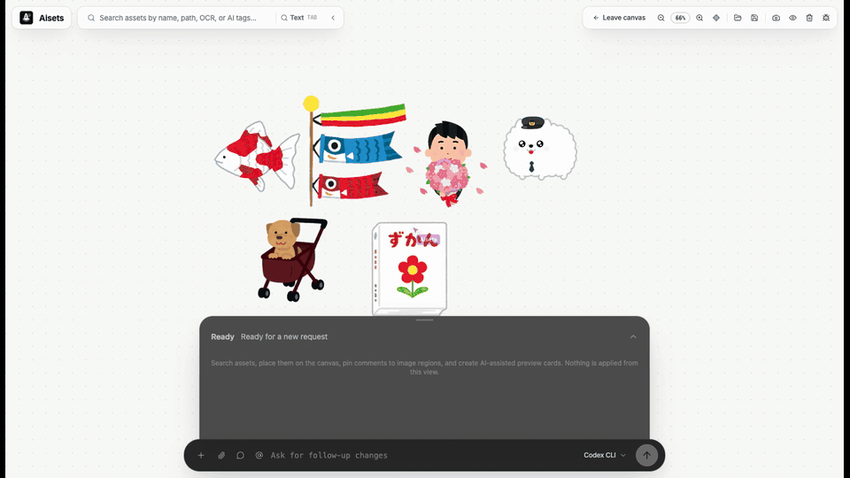
  </a>
</p>

<p align="center">
  <a href=".github/assets/readme-ai-canvas-toy-shop-demo.mp4"><strong>Watch the AI Canvas toy-shop staging demo</strong></a>
</p>

## Install

macOS / Linux:

```bash
curl -fsSL https://raw.githubusercontent.com/runkids/aisets/main/install.sh | sh
```

Windows PowerShell:

```powershell
iwr https://raw.githubusercontent.com/runkids/aisets/main/install.ps1 -UseB | iex
```

## Quick Start

```bash
# Open the dashboard for a project
aisets ui /path/to/your/project
```

The dashboard opens locally in your browser. Use `--app` if you prefer a desktop-style window.

You can also scan from the CLI:

```bash
aisets scan /path/to/your/project --json
```

Update anytime:

```bash
aisets update
```

## Why Aisets

Image debt sneaks into every codebase: duplicate icons, mystery screenshots, forgotten marketing exports, giant PNGs, unused files, broken naming, GPS metadata, and assets no one wants to touch because cleanup feels risky.

Aisets turns that pile into a visual, AI-assisted workflow:

- **See the whole mess at once** — browse every image with size, format, dimensions, duplicates, usage, optimization hints, OCR, tags, and project context.
- **Search by meaning, not filenames** — find “login screen”, “invoice screenshot”, “food photo”, or text inside images even when file names are useless.
- **Let AI label the boring stuff** — generate categories, tags, descriptions, OCR text, translations, and semantic search data.
- **Clean safely** — preview renames, duplicate merges, and unused-file deletion before anything changes.
- **Fix asset bloat before users feel it** — spot giant images, missing responsive variants, lazy-loading issues, and format-conversion wins.
- **Work across multiple repos** — great for design systems, app suites, asset packs, marketing sites, and long-lived projects.
- **Stay local-first** — run the dashboard on your machine and choose when AI uses local models or external tools.

If you have ever asked “can we delete this image?” and nobody knew the answer, Aisets is for you.

## AI That Actually Helps

Aisets is not just another file browser with an AI badge. AI is used where it makes asset maintenance faster:

- **AI tagging** — categories, descriptive tags, scene hints, face/language signals, and translated labels.
- **AI OCR** — extract text from screenshots, memes, product shots, documents, and mixed-language images.
- **Semantic search** — search assets by intent, visual meaning, tags, descriptions, and OCR text.
- **AI cleanup planning** — use agent CLIs to help turn scan findings into practical cleanup plans.
- **Content-aware workflows** — build filters around AI category, OCR content, tags, duplicate status, and optimization potential.

Supported AI paths include:

- **Local AI** — connect local / OpenAI-compatible runtimes such as Ollama or LM Studio for private workflows.
- **Agent CLIs** — integrate with coding agents including **Codex CLI** and **Pi**, plus Claude Code, Cursor Agent, Gemini CLI, and Copilot CLI.
- **Your choice** — keep everything local, use agent tools already installed on your machine, or connect compatible providers when you want them.

## Product Tour

| Track workspace health                                                                                                                                                                              | Search by meaning, not filenames                                                                                                                      |
| --------------------------------------------------------------------------------------------------------------------------------------------------------------------------------------------------- | ----------------------------------------------------------------------------------------------------------------------------------------------------- |
| 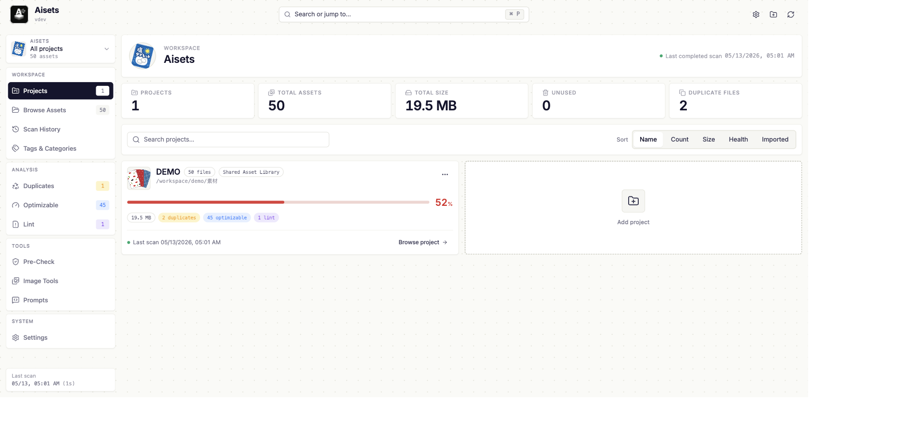 | 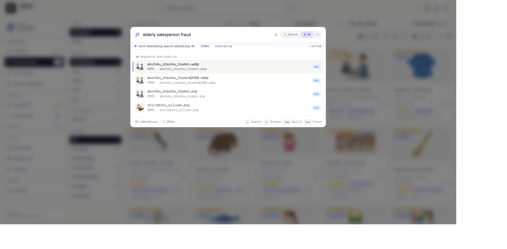 |

| Turn metadata into reusable workflows                                                                                                                                    | Audit tags and categories                                                                                                                      |
| ------------------------------------------------------------------------------------------------------------------------------------------------------------------------ | ---------------------------------------------------------------------------------------------------------------------------------------------- |
| 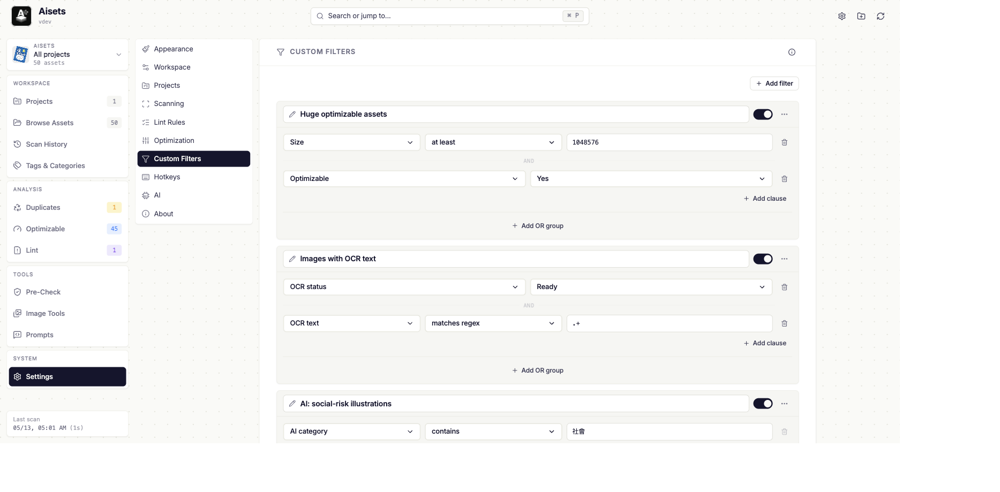 | 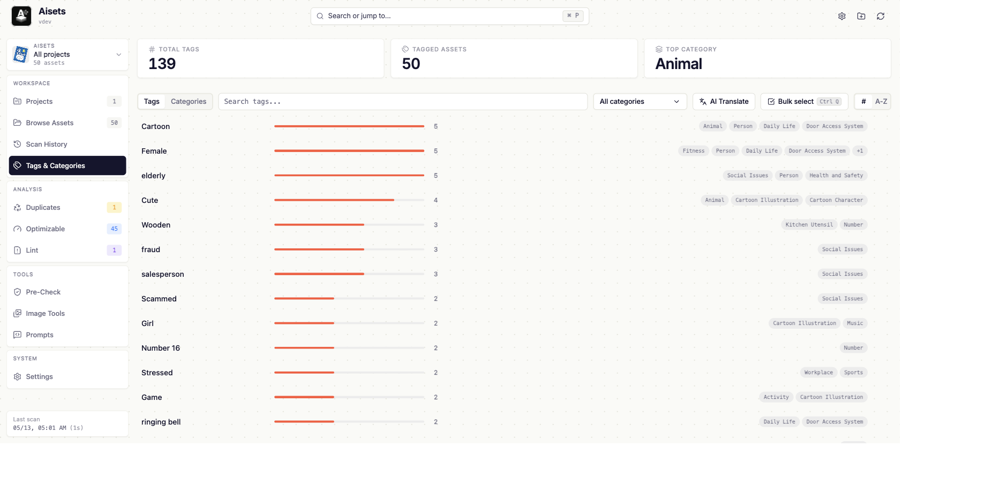 |

| Compare similar images side by side                                                                                                | Estimate optimization work                                                                                                                                           |
| ---------------------------------------------------------------------------------------------------------------------------------- | -------------------------------------------------------------------------------------------------------------------------------------------------------------------- |
| 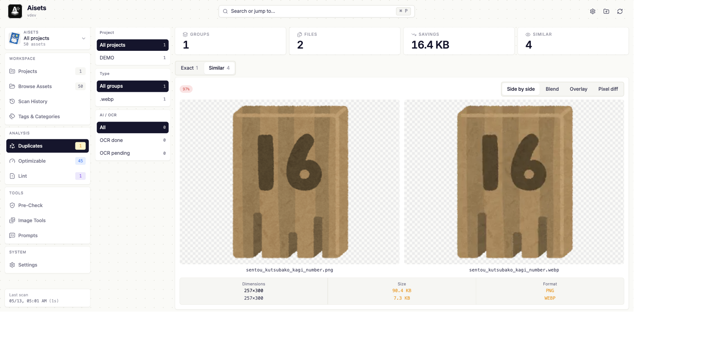 | 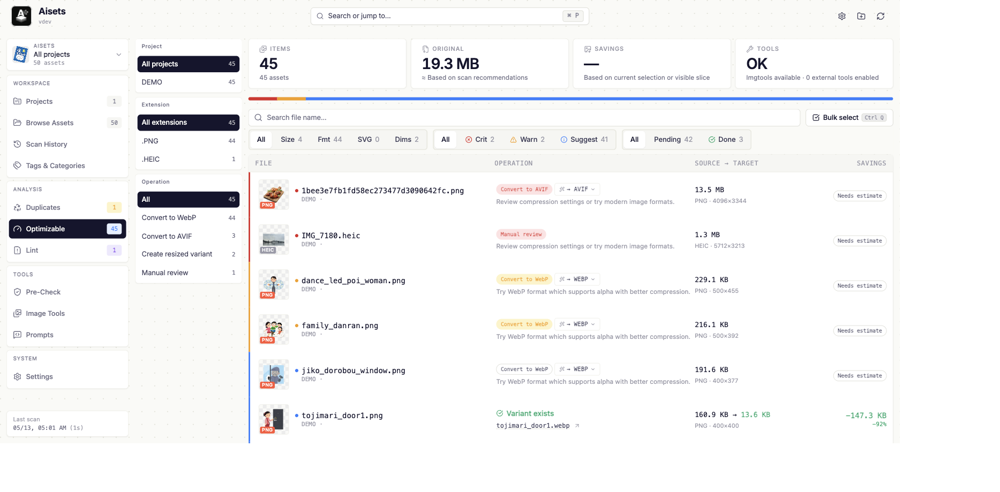 |

| Check one-off images before import                                                                                                              | Tune local AI and agent CLIs                                                                                                                                                    |
| ----------------------------------------------------------------------------------------------------------------------------------------------- | ------------------------------------------------------------------------------------------------------------------------------------------------------------------------------- |
| 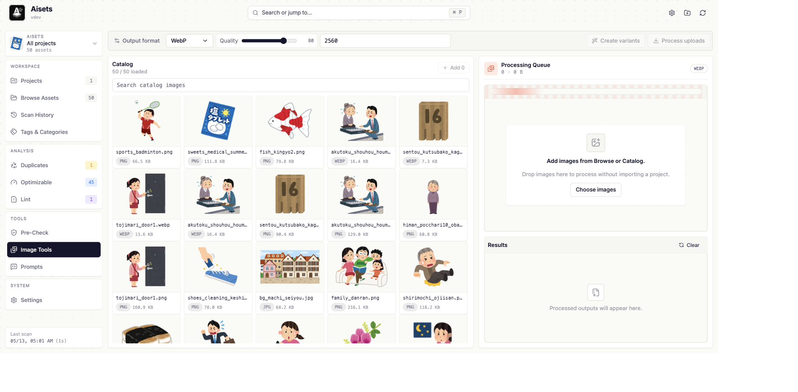 | 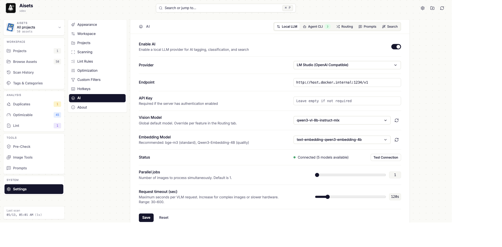 |

## What You Can Do With It

### Find duplicates before they become permanent

- Detect exact duplicate files across projects.
- Compare visually similar images side by side.
- Pick what to keep, preview the merge, and update references safely.

### Delete with confidence

- Find assets that code no longer references.
- Separate code projects from asset packs and libraries so “unused” does not become reckless.
- Preview every destructive action before applying it.

### Make images smaller without guessing

- Estimate savings before converting anything.
- Find oversized rasters, heavy GIFs, large inline imports, missing dimensions, and lazy-loading issues.
- Generate practical optimization scripts when you are ready.

### Turn image chaos into searchable knowledge

- OCR screenshots and design exports.
- Tag images automatically with AI.
- Save filters for cleanup candidates, huge files, OCR matches, AI categories, duplicated assets, and review queues.

### Check files before adding them

- Drop in new images before import.
- Catch duplicates, naming issues, and optimization opportunities early.
- Avoid adding asset debt in the first place.

## What We're Building Next

Aisets already has scanning, AI metadata, OCR, embeddings, semantic search, safe actions, Image Tools, and an AI Canvas foundation. The next work is about turning those pieces into a more trustworthy AI asset workflow:

- **AI operation safety contract** — every AI-originated file or metadata change should be typed, validated by the backend, previewable, and auditable.
- **Embedding index health** — semantic search should clearly show whether text/image vectors are ready, stale, missing, or generated by a different provider/model.
- **Assistant asset operations** — natural-language requests should return grounded asset cards, comparison previews, cleanup plans, and safe operation cards instead of text-only answers.
- **AI Canvas hardening** — keep the visual workspace focused on asset work: arrange images, inspect context, create variants, annotate regions, and review operations before applying anything.
- **Agent cleanup plans** — use Codex CLI, Pi, and other agent CLIs to generate structured cleanup plans with preview commands, blockers, verification checks, and Aisets-side validation.

## Safety First

Aisets is designed for repos you care about:

- File-changing actions use **preview → confirm → apply**.
- Apply rechecks files before writing, so stale previews are rejected.
- Project type controls how aggressive unused detection should be.
- Local-first workflows keep your assets on your machine unless you choose an external AI provider or agent.

## License

[MIT](LICENSE) © Willie
